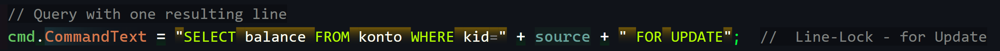
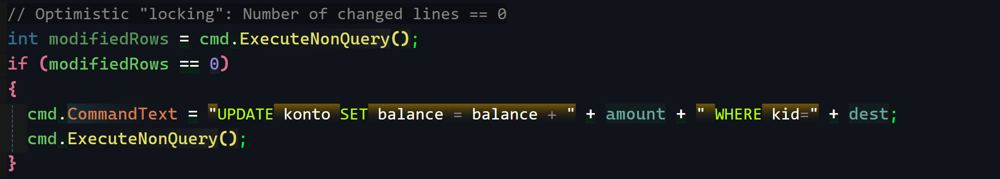
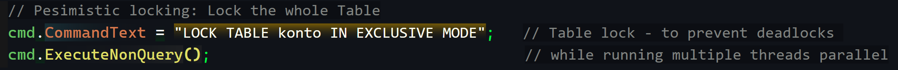
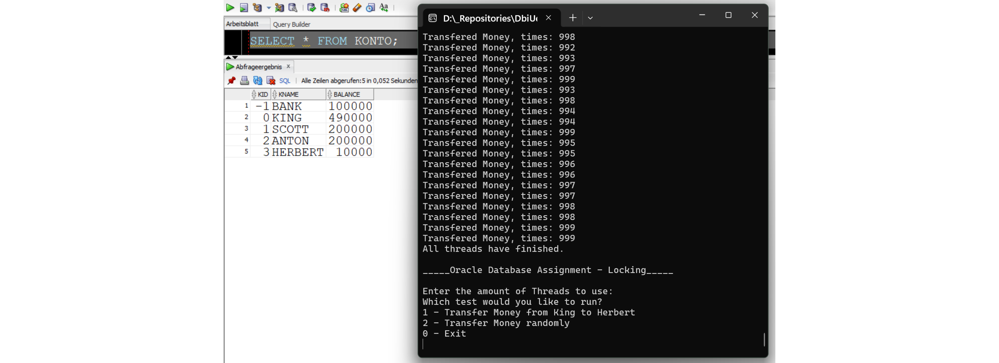
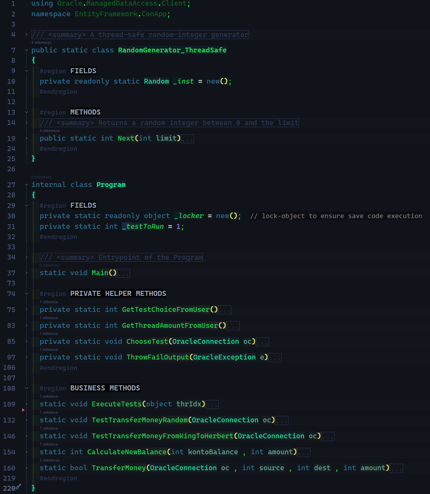

# DbiUebung-001 -- Oracle (not Entity) Framework

> ###### Todo:
> ##### Führen Sie die Tests mit numberOfParallelThreads=1 aus. Verhält sich der Code wie erwartet?  
> ##### Analysieren Sie den gegeben Code auf Probleme. Wie manifestieren sich die Probleme bei den beiden Tests?  
> ##### Beheben Sie die Nebenläufigkeitsprobleme mittels den gegeben Locking-Arten und behandeln Sie jene Fehler, die dabei auftreten können.  
> - Zeilen-Locks
> - Table-Lock
> - Optimistisches Locking

---    

- Bei nur einem Thread verhält sich der code wie erwartet, jedes query wird nacheinander abgearbeitet,  
  bei mehreren parallelen Threads können jetzt bereits Probleme auftreten.
  > Ein Zeilen-Lock scheint deadlocks nicht zu verhindern und selbst mit dem lock-object im c# code, treten ab und zu deadlocks auf (je nach cpu auslastung)
- Ich fügte, wie bereits genannt "FOR UPDATE":  
    
- sowie eine Lock-variable _locker zum code hinzu:  
  
- Als letzte Maßnahme erweiterte ich den code um einen vollständigen Table-lock, welcher die deadlocks letztendlich verhindert:  
  
    > (auch bei vielen parallellen Threads, stimmen die Transaktionen und blockieren sich nun nichtmehr)  

 ---  

- OPTIMISTIC "Locking":   
   

- PESIMISTIC Locking:   
    

 --- 

### Program ran through, with 10 parallel threads:  
 

---  
> ###### Quick overview of the code
